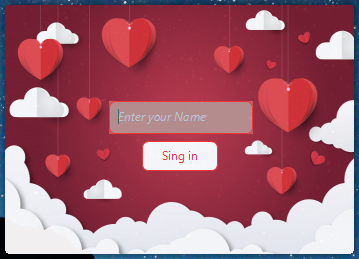
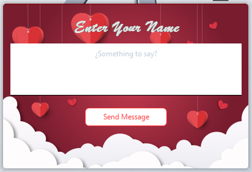

	
	
Girlfriend-master

	

	
	
	
	
	
	

 

	<a href="Contributing.md">Contribution guide</a>&nbsp;&nbsp;&nbsp;
	<a href="https://andriksantos.github.io/awesome-web-development/">Awesome List</a>&nbsp;&nbsp;&nbsp;
	<a href="https://www.redbubble.com/es/shop/ap/34065686">Store awesome</a>&nbsp;&nbsp;&nbsp;

 

		Just type <a href="https://github.com/andriksantos/awesome-web-development#awesome-web-development-"><code>awesome list universal</code></a> to go here. Check out my <a href="https://andriksantos.github.io/">web</a> and follow me on <a href="https://twitter.com/andrik_rsm">Twitter</a>.

---

Captures

Declare yourself to your crush in a unique way...

---

## Contributing

**Your contributions are always welcome!** Our list is constantly changing for continuous improvement.

Please See [contribution guidelines](https://github.com/andriksantos/awesome-web-development/blob/master/Contributing.md).

I will keep some pull requests open if I'm not sure whether those libraries are awesome, you could [vote for them](https://github.com/andriksantos/awesome-web-development/pulls) by adding :+1: to them. Pull requests will be merged when their votes reach **1**.

---

## Share

* <a href="https://twitter.com/home?status=https%3A//andriksantos.github.io/awesome-web-development/">Share in Twitter</a>
* <a href="https://www.linkedin.com/shareArticle?mini=true&url=https%3A//andriksantos.github.io/awesome-web-development/&title=Awesome%20List%20Universal&summary=Awesome%20lists%20about%20all%20kinds%20of%20interesting%20topics...%20out%20the%20limit&source=https%3A//github.com/andriksantos/awesome-web-development">Share in LinkedIn</a>
* <a href="https://www.facebook.com/sharer/sharer.php?u=https%3A//andriksantos.github.io/awesome-web-development/">Share in Facebook</a>

---

If you have any question about this opinionated list, do not hesitate to contact me [andricksantos1@gmail.com](mailto:andricksantos1@gmail.com) on Gmail or open an issue on GitHub.